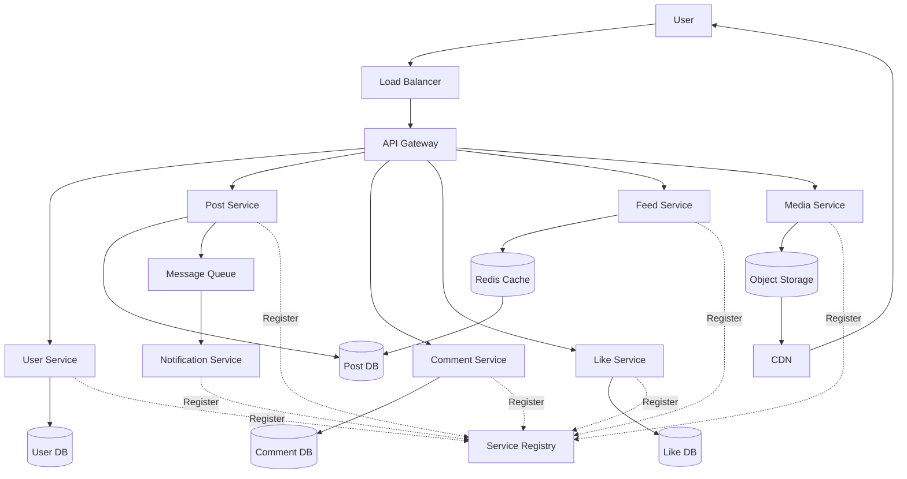

```mermaid
flowchart TD

    U[User]

    LB[Load Balancer]

    AG[API Gateway]

    US[User Service]
    PS[Post Service]
    CS[Comment Service]
    LS[Like Service]
    NS[Notification Service]
    FS[Feed Service]
    MS[Media Service]

    UDB[(User DB)]
    PDB[(Post DB)]
    CDB[(Comment DB)]
    LDB[(Like DB)]

    REDIS[(Redis Cache)]

    OS[(Object Storage)]

    CDN[CDN]

    MQ[Message Queue]

    SR[Service Registry]

    U --> LB
    LB --> AG

    AG --> US
    AG --> PS
    AG --> CS
    AG --> LS
    AG --> FS
    AG --> MS

    US --> UDB
    PS --> PDB
    CS --> CDB
    LS --> LDB

    MS --> OS

    PS --> MQ
    MQ --> NS

    FS --> REDIS
    REDIS --> PDB

    OS --> CDN
    CDN --> U

    US -. Register .-> SR
    PS -. Register .-> SR
    CS -. Register .-> SR
    LS -. Register .-> SR
    FS -. Register .-> SR
    NS -. Register .-> SR
    MS -. Register .-> SR
```