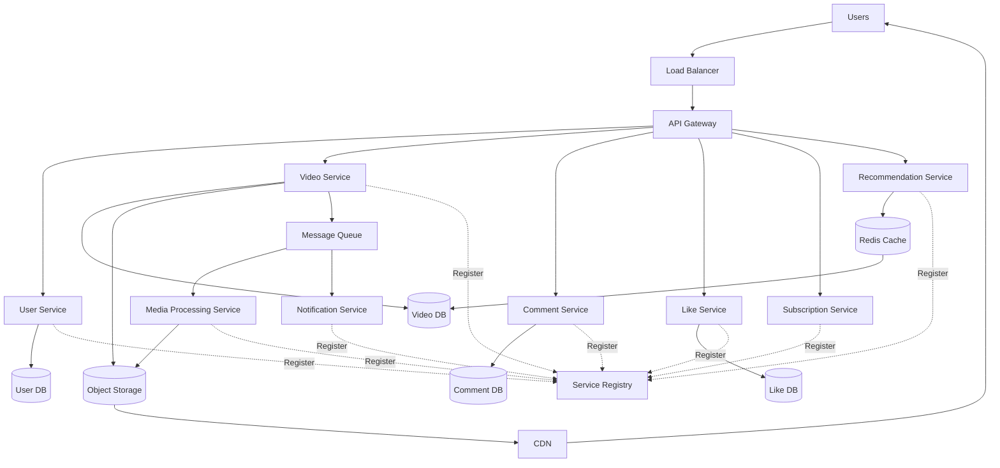

```mermaid
flowchart TD

    U[Users]

    LB[Load Balancer]

    AG[API Gateway]

    US[User Service]

    VS[Video Service]

    CS[Comment Service]

    LS[Like Service]

    SS[Subscription Service]

    NS[Notification Service]

    RS[Recommendation Service]

    MPS[Media Processing Service]

    UDB[(User DB)]

    VDB[(Video DB)]

    CDB[(Comment DB)]

    LDB[(Like DB)]

    REDIS[(Redis Cache)]

    OS[(Object Storage)]

    CDN[CDN]

    MQ[Message Queue]

    SR[Service Registry]

    U --> LB

    LB --> AG

    AG --> US
    AG --> VS
    AG --> CS
    AG --> LS
    AG --> SS
    AG --> RS

    US --> UDB
    VS --> VDB
    CS --> CDB
    LS --> LDB

    VS --> OS

    VS --> MQ

    MQ --> MPS

    MQ --> NS

    MPS --> OS

    RS --> REDIS

    REDIS --> VDB

    OS --> CDN

    CDN --> U

    US -. Register .-> SR
    VS -. Register .-> SR
    CS -. Register .-> SR
    LS -. Register .-> SR
    SS -. Register .-> SR
    NS -. Register .-> SR
    RS -. Register .-> SR
    MPS -. Register .-> SR
```
