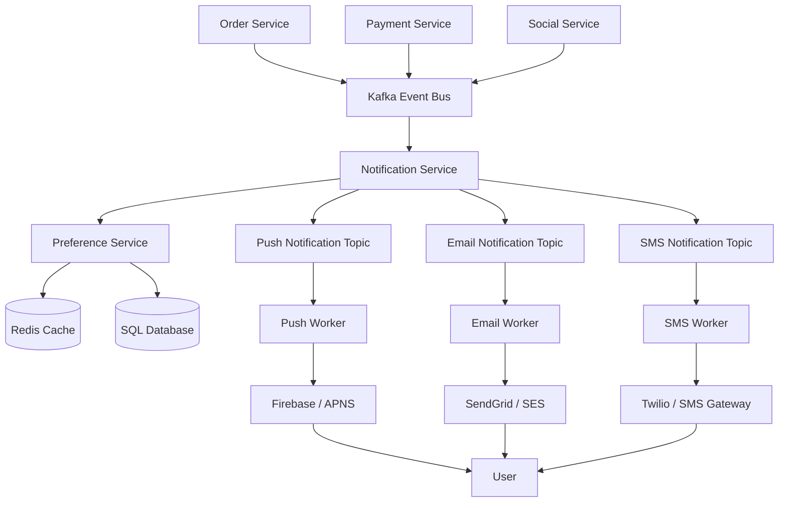
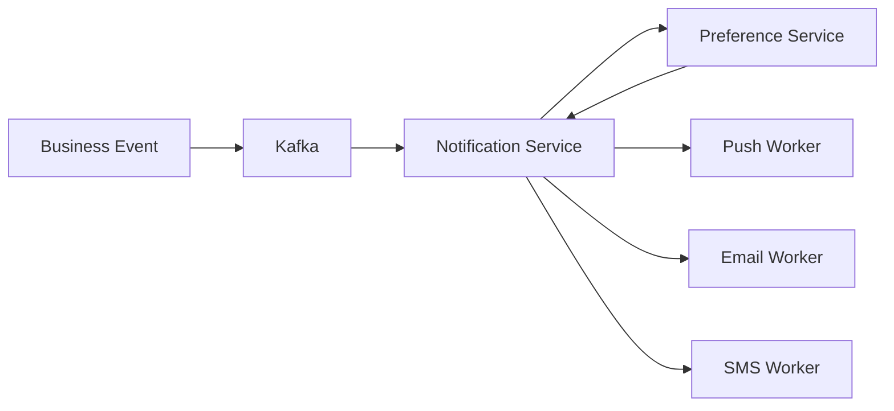
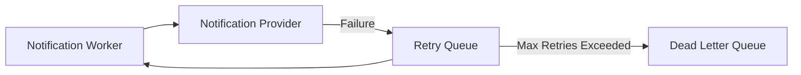
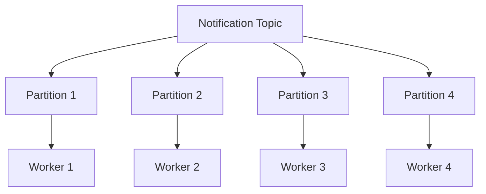

# Notification System Architecture

```mermaid
flowchart TB

    OS[Order Service]
    PS[Payment Service]
    SS[Social Service]

    K1[Kafka Event Bus]

    NS[Notification Service]

    PREF[Preference Service]

    REDIS[(Redis Cache)]

    DB[(SQL Database)]

    PUSH_TOPIC[Push Notification Topic]
    EMAIL_TOPIC[Email Notification Topic]
    SMS_TOPIC[SMS Notification Topic]

    PUSH_WORKER[Push Worker]
    EMAIL_WORKER[Email Worker]
    SMS_WORKER[SMS Worker]

    FCM[Firebase / APNS]
    SES[SendGrid / SES]
    TWILIO[Twilio / SMS Gateway]

    USER[User]

    OS --> K1
    PS --> K1
    SS --> K1

    K1 --> NS

    NS --> PREF

    PREF --> REDIS
    PREF --> DB

    NS --> PUSH_TOPIC
    NS --> EMAIL_TOPIC
    NS --> SMS_TOPIC

    PUSH_TOPIC --> PUSH_WORKER
    EMAIL_TOPIC --> EMAIL_WORKER
    SMS_TOPIC --> SMS_WORKER

    PUSH_WORKER --> FCM
    EMAIL_WORKER --> SES
    SMS_WORKER --> TWILIO

    FCM --> USER
    SES --> USER
    TWILIO --> USER
```

---

# Notification Processing Flow

```mermaid
flowchart LR

    EVENT[Business Event]

    KAFKA[Kafka]

    NS[Notification Service]

    PREF[Preference Service]

    PUSH[Push Worker]

    EMAIL[Email Worker]

    SMS[SMS Worker]

    EVENT --> KAFKA

    KAFKA --> NS

    NS --> PREF

    PREF --> NS

    NS --> PUSH
    NS --> EMAIL
    NS --> SMS
```

---

# Retry And Dead Letter Queue Flow

```mermaid
flowchart LR

    WORKER[Notification Worker]

    PROVIDER[Notification Provider]

    RETRY[Retry Queue]

    DLQ[Dead Letter Queue]

    WORKER --> PROVIDER

    PROVIDER -->|Failure| RETRY

    RETRY --> WORKER

    RETRY -->|Max Retries Exceeded| DLQ
```

---

# Horizontal Scaling With Kafka

```mermaid
flowchart TB

    TOPIC[Notification Topic]

    P1[Partition 1]
    P2[Partition 2]
    P3[Partition 3]
    P4[Partition 4]

    W1[Worker 1]
    W2[Worker 2]
    W3[Worker 3]
    W4[Worker 4]

    TOPIC --> P1
    TOPIC --> P2
    TOPIC --> P3
    TOPIC --> P4

    P1 --> W1
    P2 --> W2
    P3 --> W3
    P4 --> W4
```
