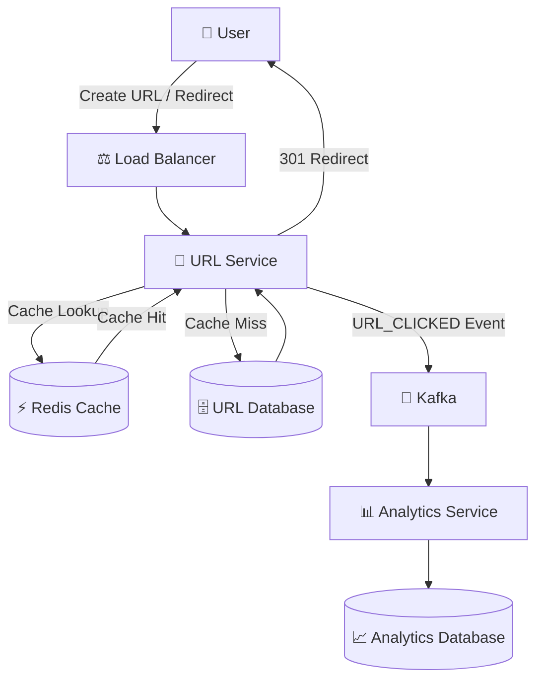
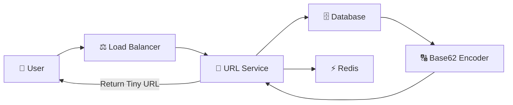
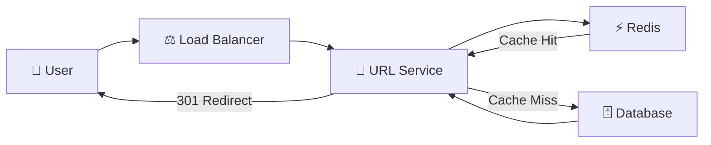
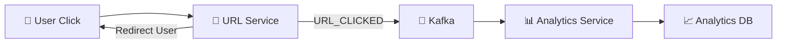

# URL Shortener Architecture

```mermaid
flowchart TB

    USER["👤 User"]

    LB["⚖️ Load Balancer"]

    URLS["🔗 URL Service"]

    REDIS[("⚡ Redis Cache")]

    DB[("🗄️ URL Database")]

    KAFKA["📨 Kafka"]

    ANALYTICS["📊 Analytics Service"]

    ADB[("📈 Analytics Database")]

    USER -->|"Create URL / Redirect"| LB

    LB --> URLS

    URLS -->|"Cache Lookup"| REDIS

    REDIS -->|"Cache Hit"| URLS

    URLS -->|"Cache Miss"| DB

    DB --> URLS

    URLS -->|"301 Redirect"| USER

    URLS -->|"URL_CLICKED Event"| KAFKA

    KAFKA --> ANALYTICS

    ANALYTICS --> ADB
```

---

# URL Creation Flow

```mermaid
flowchart LR

    U["👤 User"]

    LB["⚖️ Load Balancer"]

    S["🔗 URL Service"]

    DB["🗄️ Database"]

    B62["🔠 Base62 Encoder"]

    R["⚡ Redis"]

    U --> LB

    LB --> S

    S --> DB

    DB --> B62

    B62 --> S

    S --> R

    S -->|"Return Tiny URL"| U
```

---

# Redirect Flow

```mermaid
flowchart LR

    U["👤 User"]

    LB["⚖️ Load Balancer"]

    S["🔗 URL Service"]

    R["⚡ Redis"]

    DB["🗄️ Database"]

    U --> LB

    LB --> S

    S --> R

    R -->|"Cache Hit"| S

    S -->|"Cache Miss"| DB

    DB --> S

    S -->|"301 Redirect"| U
```

---

# Analytics Flow

```mermaid
flowchart LR

    U["👤 User Click"]

    S["🔗 URL Service"]

    K["📨 Kafka"]

    A["📊 Analytics Service"]

    DB["📈 Analytics DB"]

    U --> S

    S -->|"Redirect User"| U

    S -->|"URL_CLICKED"| K

    K --> A

    A --> DB
```
